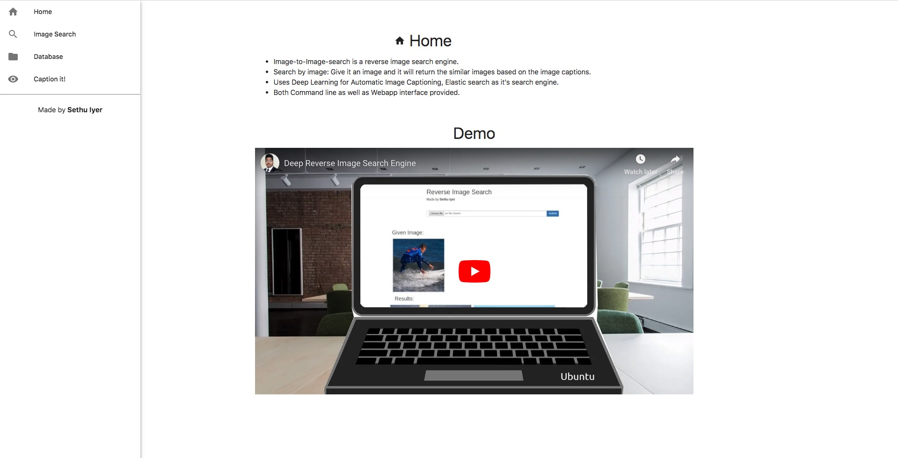

# Image-to-Image-search
* Image-to-Image-search is a reverse image search engine. 
* Search by image: Give it an image and it will return the similar images based on the image captions.
* Uses Deep Learning for Automatic Image Captioning, Elastic search as it's search engine.
* Both Command line as well as Webapp interface provided.
* Now you can index custom images, generate captions and do search!
* Mobile browsers are also supported!

## Demo
[Deep Reverse Image Search Engine - YouTube](https://www.youtube.com/watch?v=xNUL2IHl4tQ)

## Packages Required:
* Anaconda
* Keras with Tensorflow Backend (Python 3.6)
* Elastic Search and elasticsearch-py (Elastic Search 6.0)

For more, check out requirements.txt

## Pre-trained models
* [Flickr-8k LSTM weights (flickr8k\_cnn\_lstm\_v1.p)](https://cs.stanford.edu/people/karpathy/neuraltalk/flickr8k_cnn_lstm_v1.zip)

Download this and paste it inside models folder.

## Output

New Dashboard release:

Check out the screenshots folder for more!

### Files
* `capgen.py` : Takes in the image, produces image captions using LSTM (Long Short Term Memory network) (CLI and Webapp)
* `cmdline/index.py` : Parses the `static/img/` folder, indexes images and their descriptions in the elastic search server (CLI)
* `cmdline/query.py` : Given a description, returns nearest description and their image path as JSON response. (CLI)
* `cmdline/main.py` : Main program, elastic search server must be running before launching this program. (CLI)
* `server.py` : launches the webapp to do the reverse image search (Webapp)     

## Tips
* Install elasticsearch and always check if elastic search process is running before launching server.py or index_database.py.

* Instead of using the upload functionality, paste all your images inside `static/img` folder followed by `python index_database.py` to index all those images.

* If you want to delete the indexed images, do `sh delete_index.sh`

## Thanks
Thanks to Materialize CSS for the aesthetics, Pretty Printed for the flask tutorials and Andrej Karpathy for wonderful captioning library.

