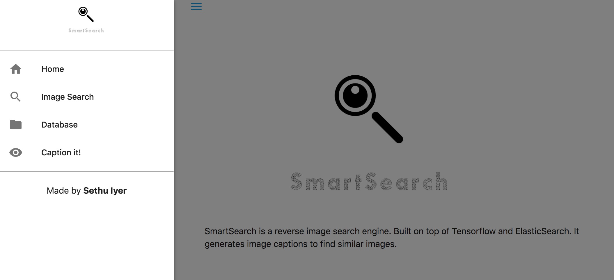

SmartSearch is a reverse image search engine which finds similar images by generating captions and comparing those captions. Powered by Tensorflow and ElasticSearch.

**Update**: REST APIs for image caption generator and image search are added! ( Shoutout to [xc0d3rz](https://github.com/xc0d3rz) )

## Demo
[Deep Reverse Image Search Engine - YouTube](https://www.youtube.com/watch?v=xNUL2IHl4tQ) demos the core functionality.

## Branches
[Docker Image](https://github.com/sethuiyer/Image-to-Image-Search/tree/docker_image)

[Basic Implementation](https://github.com/sethuiyer/Image-to-Image-Search/tree/bootstrap)

## Packages Required:
* Anaconda
* Keras with Tensorflow Backend (Python 3.6)
* Elastic Search and elasticsearch-py (Elastic Search 6.0)

For more, check out requirements.txt

## Pre-trained models
* [Flickr-8k LSTM weights (flickr8k\_cnn\_lstm\_v1.p)](https://cs.stanford.edu/people/karpathy/neuraltalk/flickr8k_cnn_lstm_v1.zip)

Download this and paste it inside models folder.

## Output

## Tips
* Install elasticsearch and always check if elastic search process is running before launching server.py or index_database.py.

* Instead of using the upload functionality, paste all your images inside `static/img` folder followed by `python index_database.py` to index all those images.

* If you want to delete the indexed images, do `sh delete_index.sh`

## Thanks
Thanks to Materialize CSS for the aesthetics, Pretty Printed for the flask tutorials and Andrej Karpathy for wonderful captioning library.
Shoutout to [xc0d3rz](https://github.com/xc0d3rz) for the REST API inclusion!
