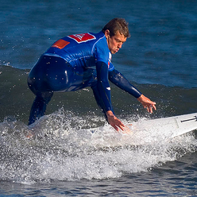

# Image-to-Image-search
Searches similar images by taking image caption as the meta-data

[Click Here](https://www.youtube.com/watch?v=AGdGVddAJJk) if you wish to see the video demo of the captioning system

## Packages Required:
* Anaconda
* Keras with Tensorflow Backend
* Elastic Search and py-elasticsearch

## Other things 
* Flickr-8k LSTM weights (flickr8k\_cnn\_lstm\_v1.p)
* Flickr-8k dataset is required.

## Output
### Input Image

### Output 

